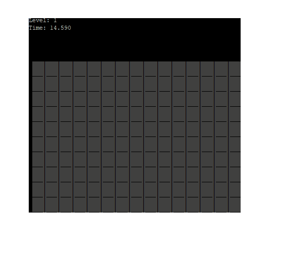

# LNF

A quick puzzle game for GGJ21. I didn't actually end up executing on this idea for GGJ21, but it felt like a good enough idea to demo out. In the end I couldn't make it quite as fun as I'd originally imagined. Oh well \*shrug\*

> Find the hidden cell on the board before the time runs out! Avoid traps and use hints on the board to guide your guesses.

# Work breakdown

* [X] render a grid
* [X] support clicking on items in the grid
* [X] support generating a solution cell and hint cells
* [X] support hiding solution cells and hint cells and only reveal cells when clicked
* [X] support "winning" by finding the solution cells
* [X] support starting a new game after winning the last game
* [X] add a game timer and support losing if you don't solve a board in time
* [X] support levels increasing in difficulty by reducing the time for harder levels
* [X] support levels increasing in difficulty by growing the board (start smaller)
* [X] support hint cells "re-hiding" to increase difficulty
* [X] support hint cells "re-hiding" faster to increase difficulty on harder levels
* [X] support making some hint cells empty to increase difficulty (more empty cells at higher levels)
* [X] support making some hint cells traps to increase difficulty (hitting a trap cell causes a confusion state)
* [ ] support start screen and kick the player back to the start screen after time on gameover screen
* [ ] support gameover screen (no leaderboard)
